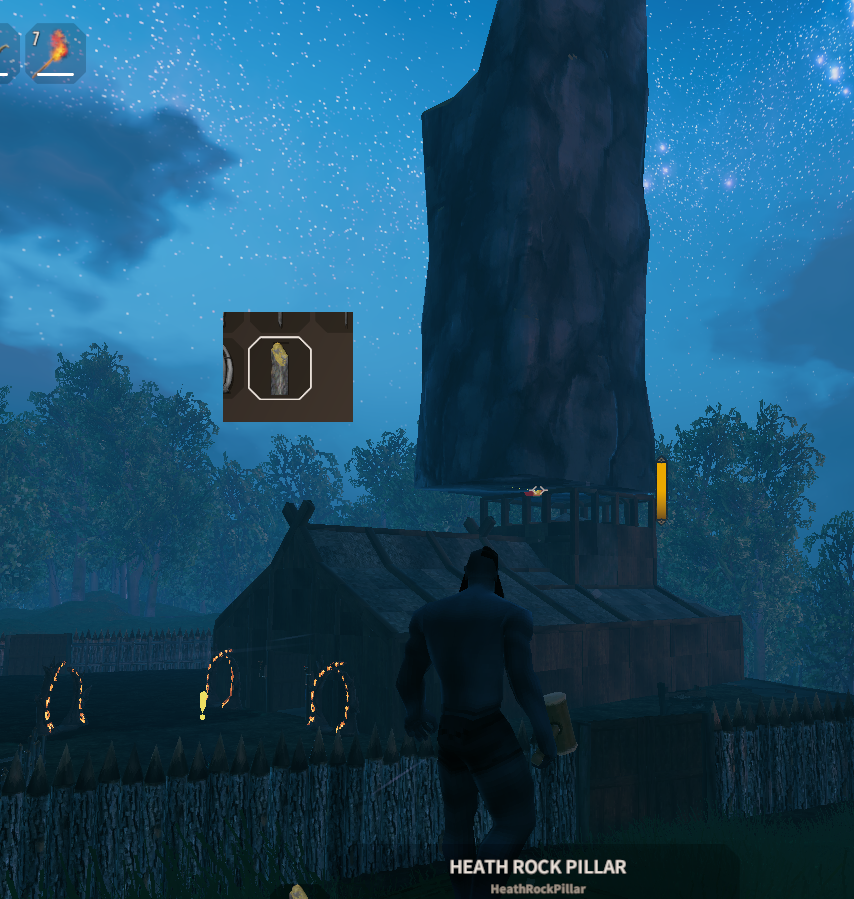

# Missing Pieces

This is an old mod I made for Valheim to add prefabs that weren’t originally available to build by creating JSON-based recipes, which then appeared in the hammer’s build menu. It’s no longer working or maintained, and I’m not affiliated with the active mod of the same name. I built it by decompiling and modifying code from another mod (can’t remember which) and am archiving it for future reference.

